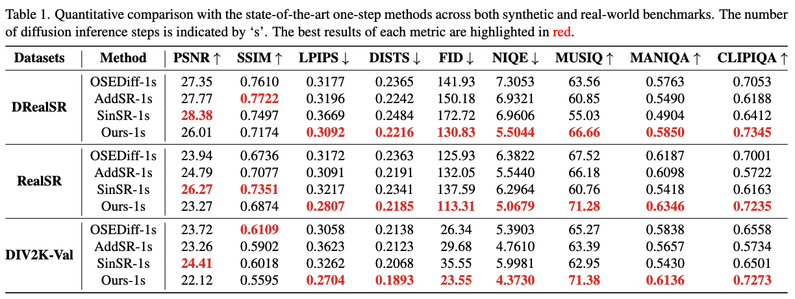
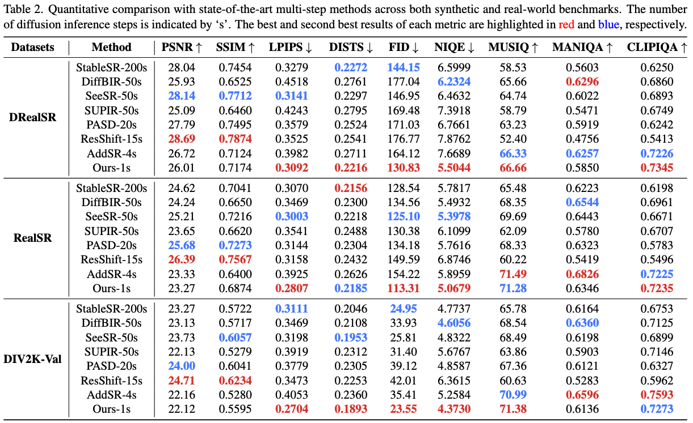

<div align="center">


<h1>TSD-SR: One-Step Diffusion with Target Score Distillation for Real-World Image Super-Resolution</h1>

<div>
    <a href='https://github.com/Microtreei' target='_blank'>Linwei Dong<sup>1,*</sup></a>&emsp;
    <a href='https://fqnchina.github.io/' target='_blank'>Qingnan Fan<sup>2,*</sup></a>&emsp;
    <a href='https://github.com/Sun-Made-By-Yi' target='_blank'>Yihong Guo<sup>1</sup></a>&emsp;
    <a href='https://github.com/Wzh10032' target='_blank'>Zhonghao Wang<sup>3</sup></a>&emsp;
    <a href='https://qzhang-cv.github.io/' target='_blank'>Qi Zhang<sup>2</sup></a>&emsp;
    <a href='https://scholar.google.com/citations?hl=zh-CN&user=Pcsml4oAAAAJ' target='_blank'>Jinwei Chen<sup>2</sup></a>&emsp;
    <a href='https://scholar.google.com/citations?user=pnVwaGsAAAAJ&hl=en' target='_blank'>Yawei Luo<sup>1,†</sup></a>&emsp;
    <a href='https://scholar.google.com/citations?user=kj5HiGgAAAAJ&hl=en' target='_blank'>Changqing Zou<sup>1,4 </sup></a>
</div>
<div>
    <sup>1</sup>Zhejiang University, <sup>2</sup>Vivo Mobile Communication Co. Ltd, <sup>3</sup>University of Chinese Academy of Sciences,  <sup>4</sup>Zhejiang Lab 
</div>

[[paper]](https://arxiv.org/abs/2411.18263)

---

</div> 

## 🔥 <a name="news"></a>News
- [2024.12] This repo is created.

## 🎬 <a name="overview"></a>Overview


## <a name="results"></a>🔎 Results
<details>
    <summary> Quantitative comparison with the state-of-the-art <b>one-step</b> methods across both synthetic and real-world benchmarks (click to expand). </summary>
    <p align="center">
    
    </p>
</details>

<details>
    <summary> Quantitative comparison with the state-of-the-art <b>multi-step</b> methods across both synthetic and real-world benchmarks (click to expand). </summary>
    <p align="center">
    
    </p>
</details>

<details>
    <summary> Visual comparisons of different <b>Diffusion-based</b> Real-ISR methods. </summary>
    <p align="center">
    
    </p>
    <p align="center">
    
    </p>
    <p align="center">
    
    </p>
    <p align="center">
    
    </p>
    <p align="center">
    
    </p>
    <p align="center">
    
    </p>
</details>

<details>
    <summary> Visual comparisons of different <b>GAN-based</b> Real-ISR methods. </summary>
    <p align="center">
    
    </p>
    <p align="center">
    
    </p>
</details>


## 🎫 <a name="license"></a>License
This project is released under the [Apache 2.0 license](LICENSE).

## <a name="citation"></a>🎓 Citation


```
@article{dong2024tsd,
  title={TSD-SR: One-Step Diffusion with Target Score Distillation for Real-World Image Super-Resolution},
  author={Dong, Linwei and Fan, Qingnan and Guo, Yihong and Wang, Zhonghao and Zhang, Qi and Chen, Jinwei and Luo, Yawei and Zou, Changqing},
  journal={arXiv preprint arXiv:2411.18263},
  year={2024}
}
```